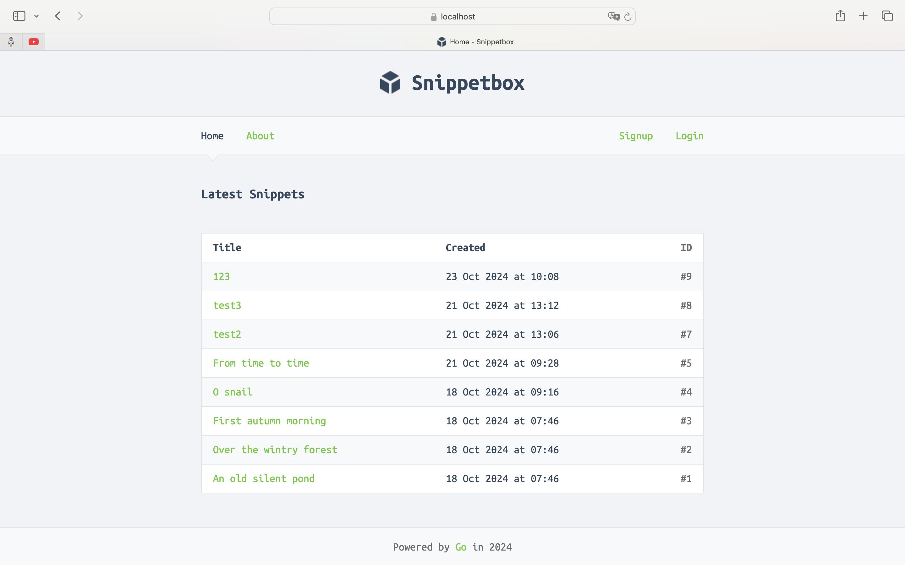

# Snippetbox

Snippetbox — это веб-приложение для создания, хранения и просмотра текстовых сниппетов(заметок), основанное на книге **"Let's Go"**.



## Оглавление
- [Описание](#описание)
- [Функциональные возможности](#функциональные-возможности)
- [Требования](#требования)
- [Установка и запуск](#установка-и-запуск)

## Описание

Snippetbox — это учебный проект. В проекте используются такие технологии, как HTTP, HTTPS,HTML-шаблоны, работа с базой данных, и предоставляется защита от атак CSRF. Приложение предоставляет функциональность для создания, просмотра и управления текстовыми сниппетами.

## Функциональные возможности

- Создание и хранение текстовых сниппетов.
- Просмотр существующих сниппетов.
- Управление временем истечения сниппетов.
- Работа с базой данных MySQL.
- Обработка HTML-шаблонов для рендеринга страниц.
- Валидация данных и обработка ошибок.
- Защита от CSRF-атак.

## Требования

Для запуска проекта необходимы:

- Go 1.23 или выше
- MySQL (для хранения данных)
- Любая ОС с поддержкой Go (Linux, macOS, Windows)

## Установка и запуск

1. **Клонирование репозитория**:

   ```bash
   git clone https://github.com/Segren/snippetbox.git
   cd snippetbox

2.	**Установите зависимости**:

    make audit

3. **Настройте базу данных MySQL**:

    Создайте базу данных и выполните следующую команду SQL для создания таблицы:

    Запустите mysql скрипт из файла init.sql
    
4.	**Запустите проект**:

    go run ./cmd/web -addr=:8080

    Альтернативно:

    ```bash
    make docker/image
    ```
    ```bash
    make docker/run
    ```

5. **Откройте браузер**:

    https://localhost:8080